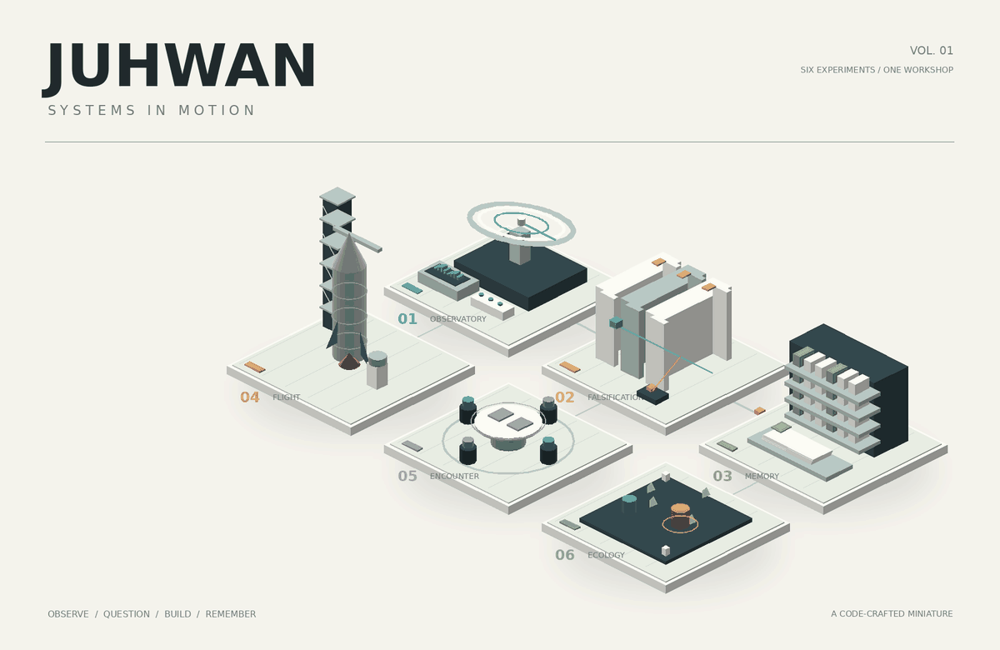
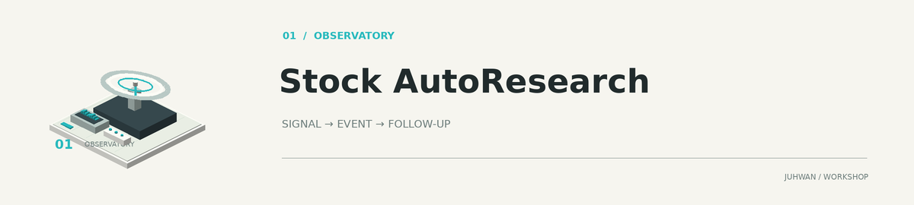
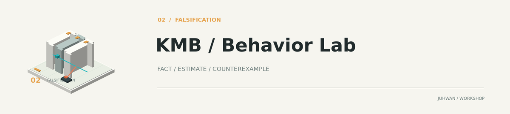
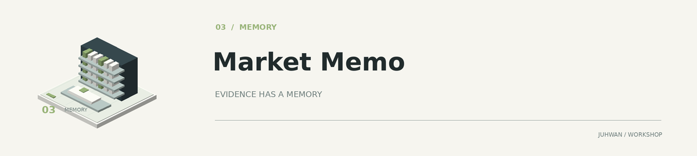
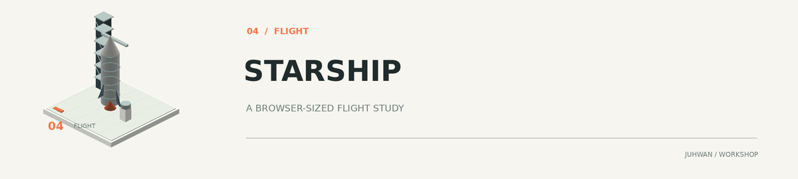
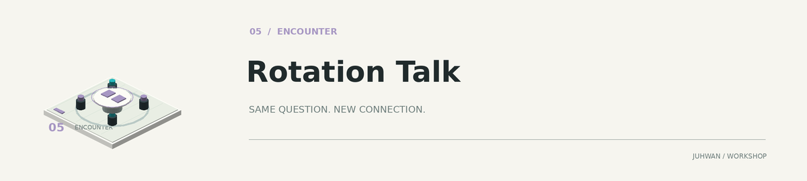
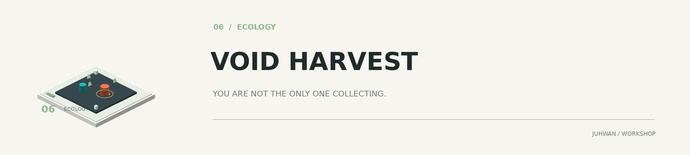

<!-- workshop:generated:start -->

<picture>
  <source media="(prefers-color-scheme: dark)" srcset="assets/workshop-dark.gif">
  <source media="(prefers-color-scheme: light)" srcset="assets/workshop-light.gif">
  
</picture>

### 시장을 관찰하고, 가설을 검증하고, 브라우저 안에 작은 세계를 만듭니다.

[시장 연구](#시장을-읽는-장치) · [작은 세계](#브라우저와-게임-속-작은-세계) · [제작 방식](docs/WORKSHOP.md)

프로젝트 구조를 코드로 그린 8초 루프 · 실시간 처리 화면이 아닌 시각적 은유

<picture>
  <source media="(prefers-color-scheme: dark)" srcset="assets/spotlight-dark.svg">
  <source media="(prefers-color-scheme: light)" srcset="assets/spotlight-light.svg">
  
</picture>

**[Stock AutoResearch](https://github.com/juhwan7/stock-autoresearch)** — 뉴스가 아니라, 사건이 변하는 과정을 기억한다면?

한국 시간의 날짜에 따라 대표 프로젝트와 강조색이 바뀝니다.

## 시장을 읽는 장치

<a href="https://github.com/juhwan7/stock-autoresearch">
<picture>
  <source media="(prefers-color-scheme: dark)" srcset="assets/specimen-01-dark.png">
  <source media="(prefers-color-scheme: light)" srcset="assets/specimen-01-light.png">
  
</picture>
</a>

### 01 · [Stock AutoResearch](https://github.com/juhwan7/stock-autoresearch)

**뉴스가 아니라, 사건이 변하는 과정을 기억한다면?**

시장 관측과 이슈 추적을 연결하는 리서치 시스템. A/B의 탐색·반증 기록과 자동복구 경로를 함께 남깁니다.

공개 리서치 화면 · 실시간 수집 정상 여부는 별도 확인 · [단계 근거](https://github.com/juhwan7/stock-autoresearch/blob/main/README.md)

[코드와 기록 ↗](https://github.com/juhwan7/stock-autoresearch) · [관측소 열기 ↗](https://juhwan7.github.io/stock-autoresearch/)

<a href="https://github.com/juhwan7/korea-market-behavior-lab">
<picture>
  <source media="(prefers-color-scheme: dark)" srcset="assets/specimen-02-dark.png">
  <source media="(prefers-color-scheme: light)" srcset="assets/specimen-02-light.png">
  
</picture>
</a>

### 02 · [Korea Market Behavior Lab](https://github.com/juhwan7/korea-market-behavior-lab)

**AI가 서로 동의하는 대신, 서로의 가설을 깨뜨리면?**

가격·거래량·수급에서 행동 가설을 만들고 근거와 반례로 검증하는 시장 연구소. 공개 데이터로 특정 계좌의 실제 보유량이나 의도를 알아낸다고 전제하지 않습니다.

연구·구현 중 · 추정 모델의 유효성 검증 진행 · [단계 근거](https://github.com/juhwan7/korea-market-behavior-lab/blob/main/src/kmb_lab/quant.py)

[코드와 기록 ↗](https://github.com/juhwan7/korea-market-behavior-lab) · [연구소 열기 ↗](https://juhwan7.github.io/korea-market-behavior-lab/)

<a href="https://github.com/juhwan7/market-memo">
<picture>
  <source media="(prefers-color-scheme: dark)" srcset="assets/specimen-03-dark.png">
  <source media="(prefers-color-scheme: light)" srcset="assets/specimen-03-light.png">
  
</picture>
</a>

### 03 · [Market Memo](https://github.com/juhwan7/market-memo)

**어제의 판단이 오늘의 검증 자료로 남는다면?**

한국·미국 시장과 산업·기업 이슈를 원문, 배경, 반론, 다음 확인사항으로 연결하는 개인 시장 아카이브.

공개 학습 아카이브 · [단계 근거](https://github.com/juhwan7/market-memo/blob/main/README.md)

[코드와 기록 ↗](https://github.com/juhwan7/market-memo) · [기록 탐색 ↗](https://juhwan7.github.io/market-memo/)

## 브라우저와 게임 속 작은 세계

<a href="https://github.com/juhwan7/starship-launch-experience">
<picture>
  <source media="(prefers-color-scheme: dark)" srcset="assets/specimen-04-dark.png">
  <source media="(prefers-color-scheme: light)" srcset="assets/specimen-04-light.png">
  
</picture>
</a>

### 04 · [STARSHIP](https://github.com/juhwan7/starship-launch-experience)

**이 발사 장면이 영상이 아니라, 브라우저에서 계산된다면?**

발사 준비부터 상승·분리까지 이어지는 WebGL 시네마틱 실험. 장면, 카메라, 재생속도를 브라우저에서 제어합니다.

공개 WebGL 데모 · 브라우저 검사 통과 기록 · [단계 근거](https://github.com/juhwan7/starship-launch-experience/actions/workflows/browser-smoke.yml)

[코드와 기록 ↗](https://github.com/juhwan7/starship-launch-experience) · [발사 경험 ↗](https://juhwan7.github.io/starship-launch-experience/)

<a href="https://github.com/juhwan7/rotation-talk-roblox">
<picture>
  <source media="(prefers-color-scheme: dark)" srcset="assets/specimen-05-dark.png">
  <source media="(prefers-color-scheme: light)" srcset="assets/specimen-05-light.png">
  
</picture>
</a>

### 05 · [Rotation Talk](https://github.com/juhwan7/rotation-talk-roblox)

**같은 질문에 같은 답을 고른 두 사람이 만나면?**

학교 강당에서 질문을 고르고, 새로운 상대를 만나는 Roblox 소셜 선택 게임. 매칭·점수·평판·저장 규칙을 함께 설계했습니다.

Studio 프로토타입 · 새 강당 화면·다중 접속 검증 전 · [단계 근거](https://github.com/juhwan7/rotation-talk-roblox/blob/main/README.md)

[코드와 기록 ↗](https://github.com/juhwan7/rotation-talk-roblox) · [Studio 빌드 받기 ↗](https://github.com/juhwan7/rotation-talk-roblox/releases/latest)

<a href="https://github.com/juhwan7/evo-3d-game">
<picture>
  <source media="(prefers-color-scheme: dark)" srcset="assets/specimen-06-dark.png">
  <source media="(prefers-color-scheme: light)" srcset="assets/specimen-06-light.png">
  
</picture>
</a>

### 06 · [Evo 3D Game / VOID HARVEST](https://github.com/juhwan7/evo-3d-game)

**경험치를 적도 먹을 수 있다면?**

플레이어와 적이 같은 파편을 놓고 경쟁하는 Three.js 생존 게임 실험. 적의 자원 소비와 변이가 선택에 어떤 영향을 주는지 탐구합니다.

공개 프로토타입 · 실제 런타임 검증 범위 제한 · [단계 근거](https://github.com/juhwan7/evo-3d-game/blob/main/data/ai/state.json)

[코드와 기록 ↗](https://github.com/juhwan7/evo-3d-game) · [프로토타입 보기 ↗](https://juhwan7.github.io/evo-3d-game/)

## 최근, 이런 부분을 바꿨습니다

- **Korea Market Behavior Lab · 코드 변경** — [product: add AI research status and topic filters](https://github.com/juhwan7/korea-market-behavior-lab/commit/5f4fb14d42067cd01ff63e93eb5122f1b4ded14a) 
  2026-09-30 23:56 KST
- **STARSHIP · 코드 변경** — [Fix fallback runtime indexing and add speed cycle](https://github.com/juhwan7/starship-launch-experience/commit/4de3288c496ed985de48990163e105b1124819de) 
  2026-09-29 09:51 KST
- **Evo 3D Game / VOID HARVEST · 문서 변경** — [docs: publish current autonomous development status](https://github.com/juhwan7/evo-3d-game/commit/ff5420af5b318e5e29f2ee663cbebbde2fc2255c) 
  2026-09-28 06:45 KST
- **Rotation Talk · 코드 변경** — [ci: publish downloadable Studio place after main updates](https://github.com/juhwan7/rotation-talk-roblox/commit/b5ea777886c1ae5cca24e65aa6f650d29d5740dc) 
  2026-09-27 06:31 KST
- **Market Memo · 문서 변경** — [시황: 2026-09-25 오늘의 핫이슈 3가지 추가](https://github.com/juhwan7/market-memo/commit/68c0ea66490ab15c15368ce9d19979f03ff7fe43) 
  2026-09-25 08:44 KST

반복 관측·스냅샷 및 데이터 전용 커밋을 제외한 최근 변경입니다. 파일 경로로 유형을 구분하며, 커밋 수를 개선 성과로 계산하지 않습니다.

## 만드는 방식

관찰에서 출발해 가설을 세우고, 구현한 뒤 반례를 찾습니다. 실패와 결정은 다음 실험이 이어받을 수 있도록 저장소에 남깁니다. 시장 연구와 3D 실험은 서로 다른 결과물이지만, **검증할 수 있는 작은 시스템을 만든다**는 방향을 공유합니다.

<b>이 장면은 어떻게 만들었을까?</b>

대표 장면과 프로젝트 이미지는 Python으로 좌표·형태·조명을 계산하고 Pillow로 그렸습니다. 80개 프레임을 GIF로 묶어 GitHub에서도 움직이게 했습니다. 라이트·다크 테마에는 각각 다른 에셋을 사용합니다.

관측 접시 → 검증 게이트 → 기억 선반, 발사대, 회전 테이블, 경쟁 생태계는 실제 프로젝트 구조에서 가져온 시각적 은유입니다. 실제 프로젝트 실행 화면을 촬영한 영상은 아닙니다.

GitHub Actions가 공개 프로젝트의 변경을 조회하고, 한국 시간 날짜에 따라 대표 프로젝트와 정적 표식을 바꿉니다. 큰 GIF는 재사용하므로 매일 새 영상이 저장되지 않습니다.

[장면 생성 코드](scripts/render_lab.py) · [프로필 생성 코드](scripts/workshop_profile.py) · [제작·상태 기준](docs/WORKSHOP.md)

<b>도구와 과거 실험</b>

Python · Java · Spring Boot · JavaScript · Three.js · Roblox/Luau · GitHub Actions

[Wordle](https://github.com/juhwan7/wordle) · [README 미니 게임](https://github.com/juhwan7/readme-mini-game) · [Vibe Coding Playground](https://github.com/juhwan7/vibe-coding-playground)

---

자료 반영: 2026-10-11 02:21 KST · 약 3시간 간격 조회 / 일일 대표 전환 · 예약 실행은 지연될 수 있습니다.

프로젝트 단계는 검토한 구현 범위입니다. 최근 커밋이나 배포 기록만으로 서비스 정상·게임 운영·AI의 현재 실행 여부를 판단하지 않습니다.

<!-- workshop:generated:end -->
